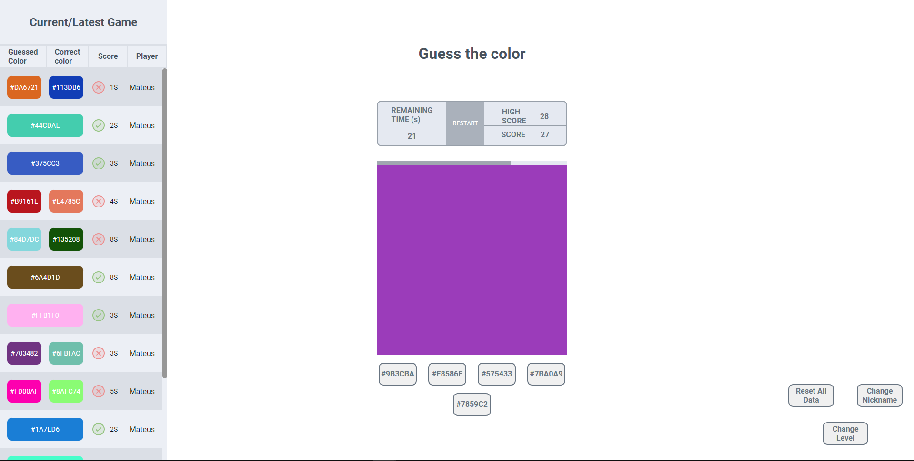
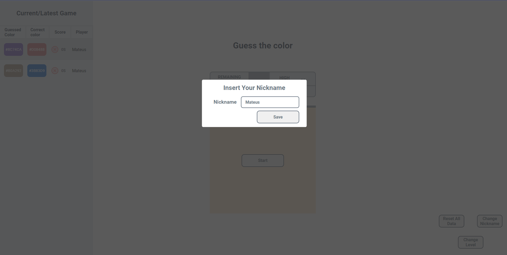
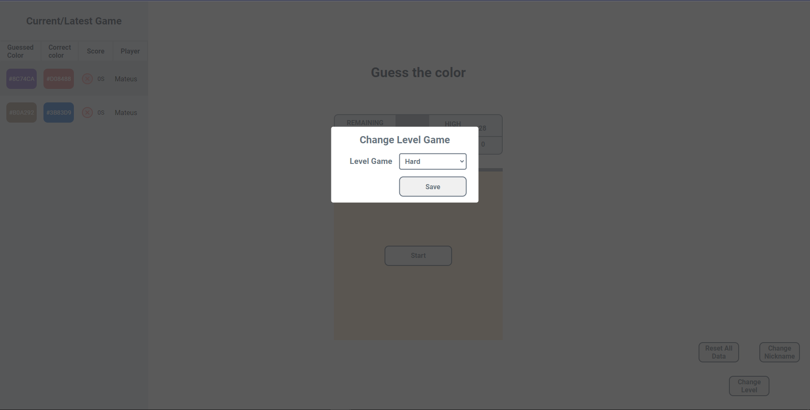

# Desafio Analytics

<p align="justify">
    Este é um projeto/teste para a vaga de Front-end ReactJS da SoftExpert.
</p>

## Objetivo

<p align="justify">
    O objetivo era criar um jogo onde o desafio é adivinhar a cor que aparece em tela em uma das opções hexadecimais que apareceram em tela, o usuário terá um tempo limite de 30 segundos para responder.
</p>

## Resolução do teste

<p align="justify">
    O primeiro passo foi realizar o layout da página, segui o protótipo disponível na descrição do teste, mas realizei algumas alterações/adições. Foi utilizado apenas CSS na estilização da aplicação.
</p>

<p align="center">
    
</p>

<p align="justify">
    A aplicação está dividida em três principais componentes. A seguir irei destrinchar cada uma passando por aspectos técnicos.
</p>

### Componente Aside

<p align="justify">
    Barra lateral à esquerda que mostrará o histórico das partidas anteriores. À medida que vai acontecendo uma rodada, esse histórico é atualizado em formato de pilha, ou seja, o último jogo é mostrado no topo da lista. Quando os itens chegam no limite da página a rolagem é ativada, assim o limite da página é respeitado.
</p>

### Componente Main

<p align="justify">
    Aqui é mostrado as informações do jogo atual, como o tempo de jogo restante, o botão "restart" que reinicia o jogo. Informação do maior placar (recorde) e do placar atual. Logo abaixo tem o botão de iniciar o jogo que quando acionado inicia o contador, diminuindo em um segundo, a barra de progresso é diminuída com o passar desse tempo. <br>
    É gerado a cor a ser "adivinhada", com base na dificuldade do jogo, é adicionando mais opções, nivel fácil são inserido 2 opções, medio 3 e difícil 4, essas cores são adicionada ao um array juntamente com a cor correta, totalizando 3|4|5.<br>
    Quando clicado em uma das opções o jogo irá fazer a verificação se a escolha está correta, durante esse processo é desabilitado os botões de escolha (para prevenir duplos cliques) e ele desaparece da tela, através de um controle de estado do react (false|true).<br>
    Caso a escolha seja correta é incrementado no placar atual cinco pontos, caso esteja incorreta é diminuído um ponto. Caso o tempo termine (chegue a zero) ele perde dois pontos.<br>
    Após essa verificação é inserido no histórico o resultado da roda, com informação da cor escolhida, qual era a correta, o tempo que ele demorou para escolher e qual o jogador (apelido).<br>
    Por fim é passado para a próxima rodada, ou seja, o tempo é reiniciado e novas cores são geradas. Assim o jogo é infinito, possibilitando resultados negativos.
</p>

### Componente Nav

<p align="justify">
    Responsável por ter algumas configurações, como botão de reiniciar dados, ira apagar todas as informações de histórico de jogos anteriores e recorde. <br>
    Mudar o apelido do jogador e o de mudar a dificuldade do jogo, que são acionadas através do componente modal.
</p>

### Componente Modal

<p align="justify">
    Componente usado quando o usuario seleciona a opção de alterar apelido ou alterar a dificuldade da pagina.
</p>

<p align="center">
    
    
</p>

## Context API

<p align="justify">
    Foi criado o gameContext onde é armazenado os estados que são compartilhados entre os componentes. A seguir é listado quais as informações e funções compartilhadas. Algumas das informações são salvas no local storage, assim mesmo que seja atualizado a página ou reaberto as informações são mantidas.<br>
    <ul>
        <li>Informação/função de armazenar no histórico. Está informação é salva no local storage.</li>
        <li>Informação/função de recorde. Está informação é salva no local storage.</li>
        <li>Informação/função do apelido. Está informação é salva no local storage.</li>
        <li>Informação/função da dificuldade do jogo. Está informação é salva no local storage.</li>
        <li>Função para apagar todos os dados referente a histórico e recorde do jogo.</li>
        <li>Função para manipular abertura e fechamento do componente Modal.</li>
    </ul>
</p>

## Tecnologias utilizadas

<ul>
   <li>Typescript</li>
   <li>React</li>
   <li>Vite</li>
   <li>CSS</li>
   <li>Docker</li>
</ul>

## Como Rodar o projeto
É recomendado estar com o docker instalado na maquina para executar o projeto, mas tambem é possivel executar apenas com node, instalando as dependencias e rodando o comando: ``` npm ci && npm run dev ```.

Clone este projeto em um diretório e mude para o diretório frontend:

```console
cd frontend
```
Inicie os containers necessarios:

```console
docker-compose up -d
```
O aplicativo estará disponível em

```console
http://localhost:3001/
```
